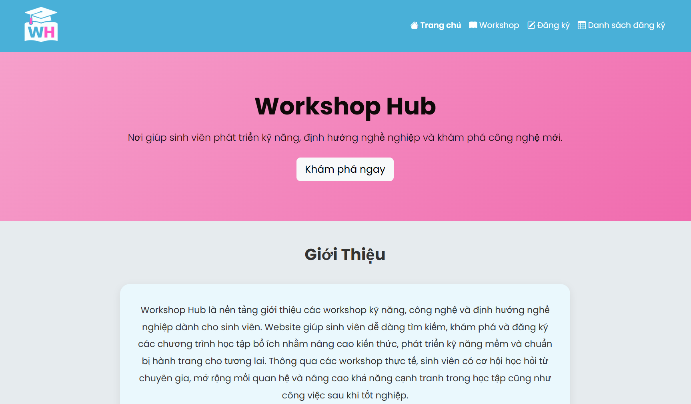
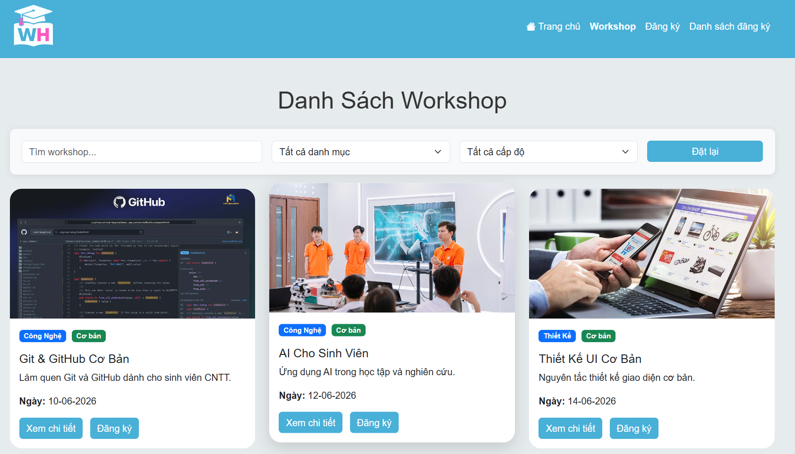
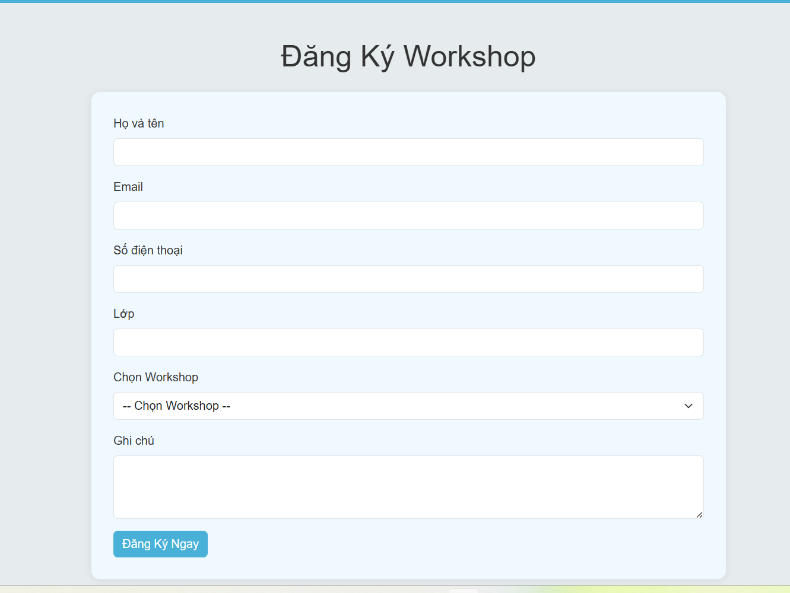
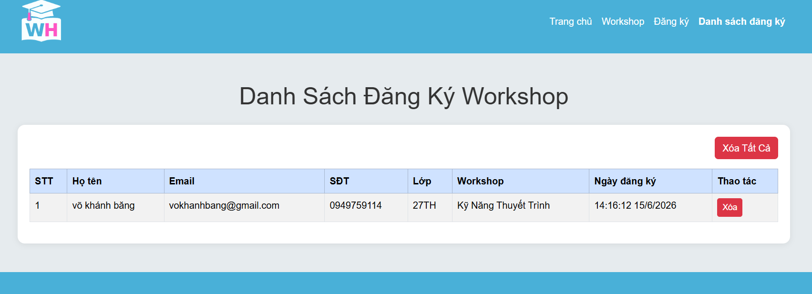

# Tên đề tài: WORKSHOP HUB

## 1. Thông tin sinh viên

* Họ và tên: Võ Khánh Băng
* MSSV: 24210501052
* Lớp:24210TH001
## 2. Mô tả đề tài

Workshop Hub là website hỗ trợ sinh viên tìm kiếm, khám phá và đăng ký tham gia các workshop về công nghệ, thiết kế, kỹ năng mềm và định hướng nghề nghiệp.

Website cho phép người dùng xem thông tin workshop, tìm kiếm, lọc dữ liệu, đăng ký tham gia và quản lý danh sách đăng ký.

## 3. Danh sách chức năng

### Trang chủ

* Hiển thị giới thiệu website.
* Hiển thị workshop nổi bật.
* Hiển thị lợi ích khi tham gia workshop.

### Trang Workshop

* Hiển thị danh sách workshop.
* Tìm kiếm workshop theo tên.
* Lọc workshop theo danh mục.
* Lọc workshop theo cấp độ.
* Xem chi tiết workshop bằng Modal Bootstrap.

### Trang Đăng ký

* Nhập thông tin đăng ký.
* Kiểm tra dữ liệu hợp lệ.
* Lưu dữ liệu bằng LocalStorage.

### Trang Danh sách đăng ký

* Hiển thị danh sách đăng ký.
* Xóa từng đăng ký.
* Xóa toàn bộ danh sách đăng ký.

## 4. Công nghệ sử dụng

* HTML5
* CSS3
* Bootstrap 5
* JavaScript (ES6)
* LocalStorage

## 5. Link GitHub Pages

Link website:https://bangkv22.github.io/vo-khanh-bang_24210501052/

## 6. Ảnh giao diện

### Trang chủ

### Trang Workshop

### Trang Đăng ký

### Trang Danh sách đăng ký

## 7. Hướng dẫn chạy chương trình

### Cách 1

* Mở file index.html bằng trình duyệt.

### Cách 2 (Khuyến nghị)

* Mở dự án bằng Visual Studio Code.
* Cài đặt Live Server.
* Chuột phải file index.html.
* Chọn Open with Live Server.
